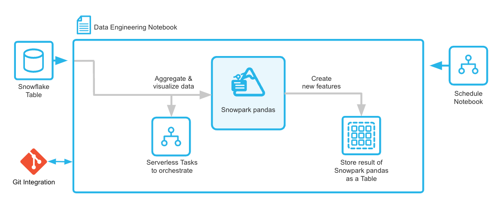
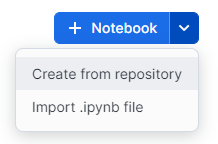
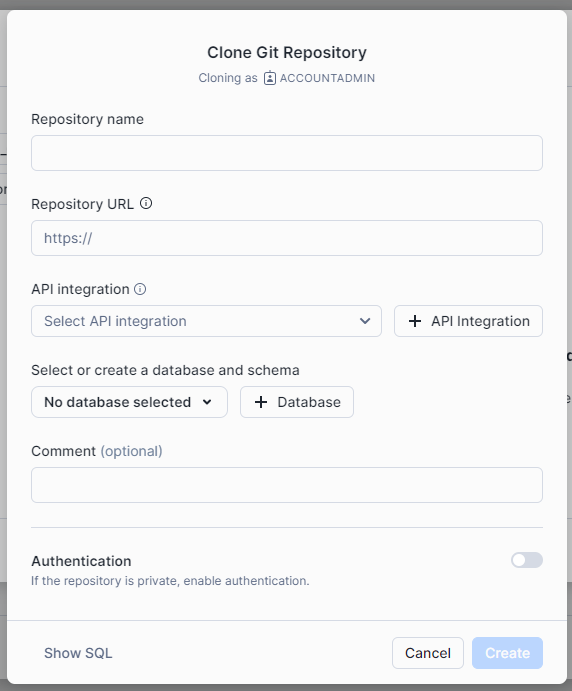
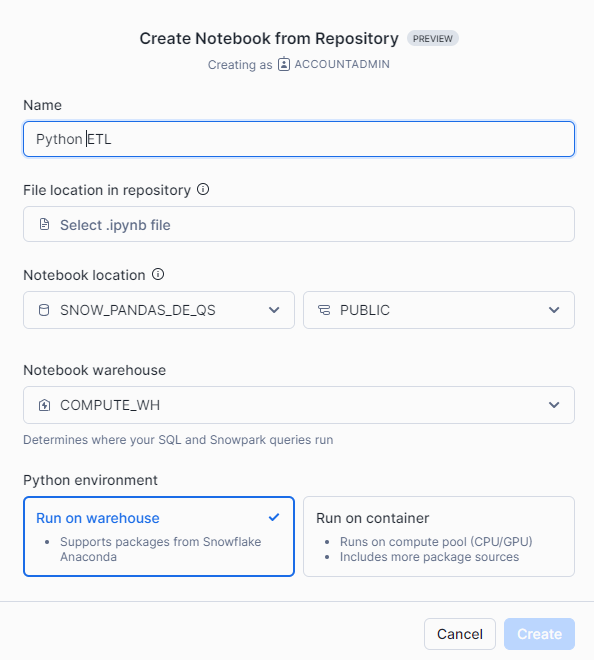

# Data Engineering Pipelines with Pandas on Snowflake

## Architecture 



## Setup Snowflake

1. **Clone or Download this Repository**
2. **Create a Snowflake Account** on [snowflake.com](https://www.snowflake.com).
3. **Set up Snowflake Resources**
   - Log into your Snowflake account and execute the following SQL code in any warehouse (WH):
   
   ```sql
   USE ROLE ACCOUNTADMIN;

   CREATE DATABASE SNOW_PANDAS_DE_QS;
   CREATE SCHEMA SNOW_PANDAS_DE_QS.NOTEBOOKS;
   CREATE SCHEMA SNOW_PANDAS_DE_QS.DATA;

   CREATE WAREHOUSE SNOW_PANDAS_DE_QS_WH;
   ```

4. **Create Notebook from Repository**
   - Go to **Projects → Notebook**, and in the dropdown list, select "Create from repository".

   

   - If you don't have a Git repository connected yet, click "Create Git repository". In the opened window, provide the required information.

   

5. **Set up API Integration**
   - You will also need to create a new API integration in Snowflake. Run the following query in the worksheet:

   ```sql
   CREATE OR REPLACE API INTEGRATION git_api_integration
       API_PROVIDER = git_https_api
       API_ALLOWED_PREFIXES = ('https://github.com/<your-username>')
       ENABLED = true
       ALLOWED_AUTHENTICATION_SECRETS = all;
   ```

6. **Configure Notebook**
   - Once the Git repository is connected, choose the desired database and schema for the notebook, then click "Create".

   

### Note 
During the Git push request, you might be prompted to provide a personal access token to GitHub. You can generate one at [github.com/settings/tokens](https://github.com/settings/tokens).

## Related Material 

- [Traces for Snowflake](https://quickstarts.snowflake.com/guide/getting_started_with_traces/index.html?index=..%2F..index#0)
- [CI/CD Pipelines with Python](https://quickstarts.snowflake.com/guide/data_engineering_with_notebooks/index.html?index=..%2F..index#0)

This code and documentation are based on the workshop **"Build End-to-End Python Pipelines in Snowflake"** provided by [Snowflake](https://www.snowflake.com/en/).

All rights and intellectual property of this repository belong to [Snowflake](https://www.snowflake.com/en/).
